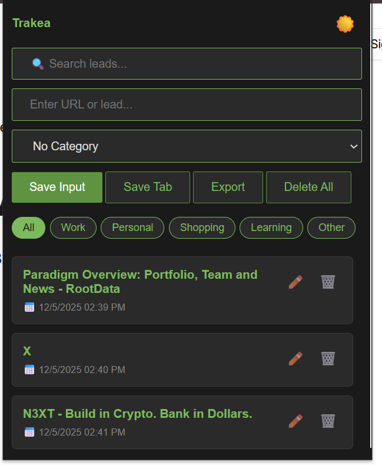

# Trakea

A Chrome extension for saving, organizing, and managing web links (leads). 
Perfect for researchers, developers, marketers, or anyone who needs to keep track of important URLs.


## 📋 Table of Contents
- [Features](#features)
- [Installation](#installation) 
- [Usage](#usage)
- [Project Structure](#project-structure)
- [Technologies Used](#technologies-used)
- [Screenshots](#screenshots)
- [Contributing](#contributing)
- [Future Enhancements](#future-enhancements)
- [License](#license)
- [Author](#author)

## ✨ Features

### Core Functionality
- **💾 Save URLs Manually** - Type or paste any URL to save it to your leads list
- **🔖 Save Current Tab** - One-click save of the currently active browser tab
- **📝 Custom Titles** - Add custom names/titles to your saved leads for better organization
- **📄 Notes System** - Attach notes to any lead for additional context or reminders

### Organization & Search
- **🔍 Real-time Search** - Instantly filter leads by title, URL, or notes
- **🏷️ Category Tags** - Organize leads into categories: Work, Personal, Shopping, Learning, Other
- **🎯 Category Filters** - Quick filter buttons to view leads by category
- **📅 Timestamps** - Every lead shows when it was saved
- **👁️ Visit Tracking** - Automatically tracks how many times you've visited each lead

### Management Features
- **✏️ Edit Leads** - Full editing capability with a beautiful modal interface
  - Update title
  - Modify URL
  - Edit notes
  - Change category
- **🗑️ Delete Options**
  - Delete individual leads with confirmation
  - Double-click to delete all leads
- **↩️ Undo Delete** - 5-second undo window after deleting all leads
- **⚠️ Duplicate Detection** - Prevents saving the same URL twice

### Data & Customization
- **💾 Export Data** - Export all leads as a JSON file with timestamp (will update this in coming versions to have options to export as csv, json, txt and other data file formats)
- **🌙 Dark Mode** - Toggle between light and dark themes
- **☁️ Cloud Sync** - Automatic syncing across all your Chrome browsers using Chrome Storage API
- **🎨 Visual Feedback** - Color-coded category badges and hover effects

## 🚀 Installation

### Method 1: Load Unpacked Extension (For Developers)

1. **Download or Clone the Repository**
   ```bash
   git clone https://github.com/Kosisochukwu244/Trakea
   ```
   Or download as ZIP and extract.

2. **Open Chrome Extensions Page**
   - Navigate to `chrome://extensions/`
   - Or click Menu (⋮) → More Tools → Extensions

3. **Enable Developer Mode**
   - Toggle the "Developer mode" switch in the top-right corner

4. **Load the Extension**
   - Click "Load unpacked"
   - Select the folder containing your extension files
   - The extension icon should appear in your toolbar

5. **Pin the Extension** (Optional)
   - Click the puzzle piece icon in Chrome toolbar
   - Find "Leads Tracker" and click the pin icon

### Method 2: Install from Chrome Web Store (Coming Soon)
_This extension will be available on the Chrome Web Store in the future._

## 📖 Usage

### Saving Leads

**Save Current Tab:**
1. Navigate to the webpage you want to save
2. Click the Leads Tracker extension icon
3. Click the "Save Tab" button
4. The page title and URL are automatically saved

**Save Manual URL:**
1. Click the extension icon
2. Type or paste a URL in the input field
3. (Optional) Select a category from the dropdown
4. Click "Save Input"

### Organizing Leads

**Add Categories:**
- When saving, select a category from the dropdown menu
- Or edit an existing lead to add/change its category

**Filter by Category:**
- Click any category button (All, Work, Personal, etc.) to filter your lead 
### Managing Leads

**Edit a Lead:**
1. Click the ✏️ (edit) icon on any lead
2. Modify title, URL, notes, or category in the modal
3. Click "Save" to confirm changes

**Delete a Lead:**
- Click the 🗑️ (trash) icon on any lead
- Confirm the deletion in the popup

**Delete All Leads:**
- Double-click the "Delete All" button
- An undo notification appears for 5 seconds
- Click "Undo" to restore if deleted accidentally

**Export Your Data:**
- Click the "Export" button
- A JSON file downloads with all your leads
- Filename includes the current date

### Customization

**Toggle Dark Mode:**
- Click the 🌙/☀️ icon in the header
- Theme preference syncs across all your Chrome browsers

## 📁 Project Structure

```
leads-tracker/
├── index.html          # Main popup interface
├── index.js            # Application logic and functionality
├── style.css           # Styling and dark mode
├── manifest.json       # Extension configuration
├── images/             # Icons and images
│   └── icon.png        # Extension icon (16x16, 48x48, 128x128)
└── README.md           # Documentation
```

## 🛠️ Technologies Used

- **HTML5** - Structure and markup
- **CSS3** - Styling, animations, and dark mode
- **JavaScript (ES6+)** - Application logic
- **Chrome Extensions API**
  - `chrome.tabs` - For capturing current tab information
  - `chrome.storage.sync` - For cloud storage and syncing
- **JSON** - Data storage and export format

### screenshot

### Dark Mode



## 🤝 Contributing

Contributions are welcome! Here's how you can help:

1. **Fork the repository**
2. **Create a feature branch**
   ```bash
   git checkout -b feature/AmazingFeature
   ```
3. **Commit your changes**
   ```bash
   git commit -m 'Add some AmazingFeature'
   ```
4. **Push to the branch**
   ```bash
   git push origin feature/AmazingFeature
   ```
5. **Open a Pull Request**

### Areas for Contribution
- Bug fixes and improvements
- New features
- Documentation enhancements
- UI/UX improvements
- Testing

## 🔮 Future Enhancements

Potential features for future versions:

- [ ] **Import Data** - Import leads from JSON files
- [ ] **Folders/Subfolders** - Multi-level organization
- [ ] **Tags System** - Multiple tags per lead instead of single category
- [ ] **Share Leads** - Share individual leads or entire collections
- [ ] **Keyboard Shortcuts** - Quick actions via keyboard
- [ ] **Bulk Operations** - Select multiple leads for batch actions
- [ ] **Lead Preview** - Screenshot or preview of saved pages
- [ ] **Sorting Options** - Sort by date, title, visits, or category
- [ ] **Search History** - Save frequently used search queries
- [ ] **Chrome Bookmarks Integration** - Import/export to Chrome bookmarks
- [ ] **Statistics Dashboard** - Analytics on your saved leads
- [ ] **Reminder System** - Set reminders to revisit specific leads


## 👨‍💻 Author

**Kosi**

- GitHub: [@Kosisochukwu244](https://github.com/Kosisochukwu244)
- Project Link: [https://github.com/Kosisochukwu244/Trakea](https://github.com/Kosisochukwu244/Trakea)

## 🙏 Acknowledgments

- Inspired by the need for better bookmark management
- Built as a learning project to understand Chrome Extensions
- Thanks to the Chrome Extensions documentation and community

---

**⭐ If you find this extension useful, please consider giving it a star on GitHub!**

## 📞 Support

If you encounter any issues or have questions:
- Open an issue on GitHub
- Check existing issues for solutions
- Contact via email: godswillchukwudime@gmail.com

---

**Happy Lead Tracking! 🎯**